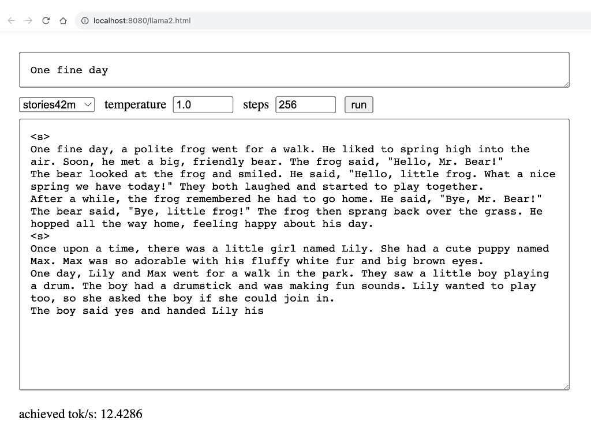

## llama2.js

<p align="center">
  
</p>

A pure JavaScript port of Karpathy's [llama2.c](https://github.com/karpathy/llama2.c) with a simple UI.

## How to run
1. Download Karpathy's Llama2 ([Orig instructions](https://github.com/karpathy/llama2.c#feel-the-magic)) parameters pretrained on [TinyStories](https://huggingface.co/datasets/roneneldan/TinyStories) dataset 

    ```bash
    wget https://huggingface.co/karpathy/tinyllamas/resolve/main/stories15M.bin
    wget https://huggingface.co/karpathy/tinyllamas/resolve/main/stories42M.bin
    wget https://huggingface.co/karpathy/tinyllamas/resolve/main/stories110M.bin
    ```
2. Open run.html via a WebServer
   
   ```bash
    python -m http.server 8080
    open http://localhost:8080/run.html
    ```

## Performance

Tokens/sec measurement on Apple M1

|    tok/s   | 15M | 42M | 110M |
|-------|-----|-----|-----|
| 🐢 |  ~30|   ~13   | ~5 |


## License
MIT
